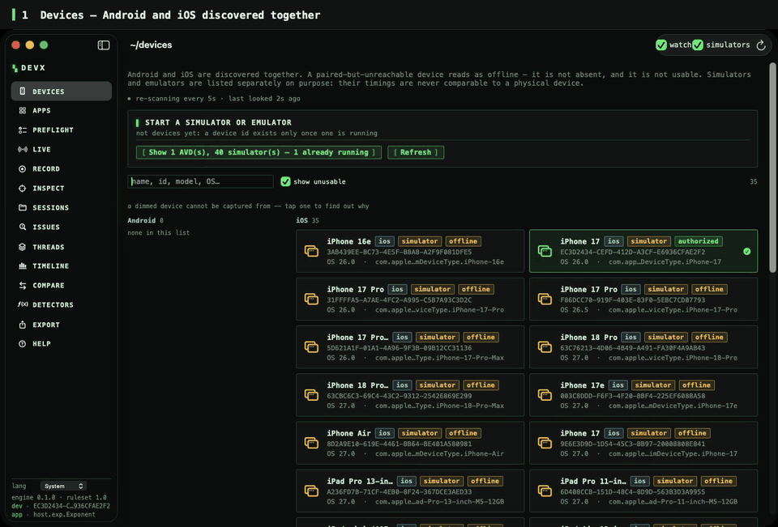
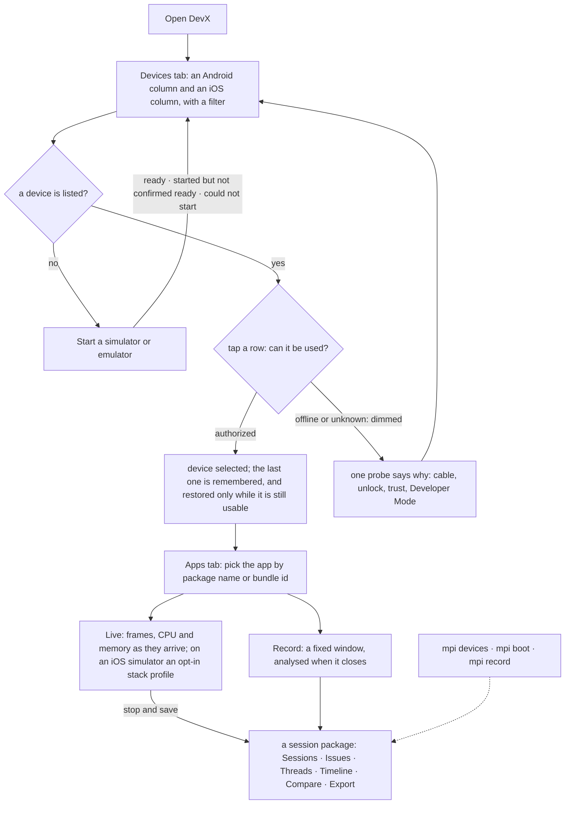
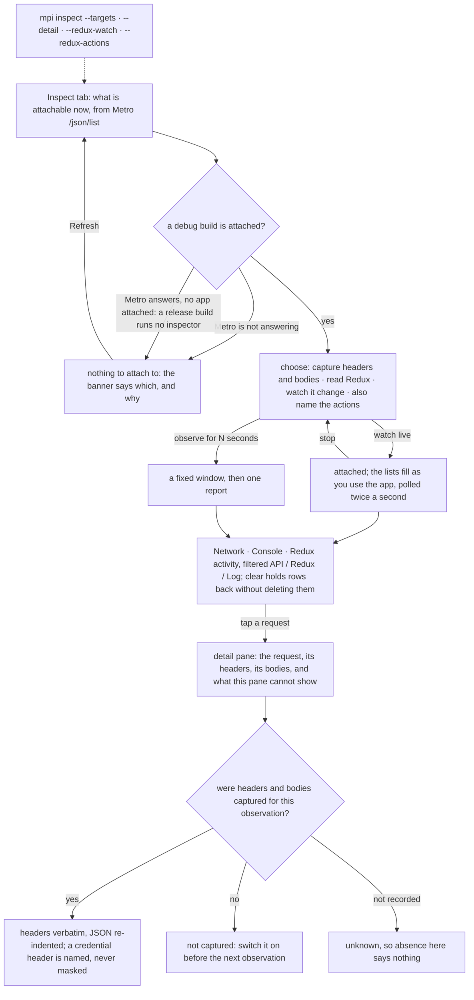

# Mobile Performance Inspector (`mpi`)

A cross-platform mobile performance profiler with a C++20 analysis core.

Implements **M0**, **M1** and **M2** on Android of
`MOBILE_PROFILER_IMPLEMENTATION_SPEC_EN.md` v2.0, which is not checked into this repository. On iOS the simulator streams through its own collector and a physical device records through `xctrace`, which has not completed a recording on this host.

Three pieces:

- **`mpi`** — the headless CLI.
- **`DevX.app`** — the native macOS desktop app (SwiftUI over a C ABI).
- **`devx-serve`** — the same views over loopback HTTP, for a host without
  SwiftUI.



[Full-quality MP4](docs/media/devx-demo.mp4). The live capture is real: Expo Go on an iOS 26 simulator, streamed for about 20 s. The Issues, Timeline and Compare scenes are sessions imported from [`fixtures/`](fixtures/README.md), and the app labels the synthetic ones as synthetic on screen.

> **Read this first.** Android live capture works and is verified against a
> real emulator. **iOS capture is partial**: a simulator streams in DevX's Live tab through its own collector (CPU time, memory footprint, per-thread times, optional stacks; no frames, because no command-line frame source exists), a physical device records through `xctrace`, which attaches on this host and has never finished, and no physical
> device of either platform was reachable during development, so the
> physical-device path is explicitly **unverified**. `mpi record` refuses to
> fabricate a capture. What works, what does not, and what was measured:
> [`docs/known-limitations.md`](docs/known-limitations.md) and
> [`docs/capabilities/tested-capability-matrix.md`](docs/capabilities/tested-capability-matrix.md).

---

---

## What works today

| | Android | iOS |
|---|---|---|
| Device discovery | ✅ `adb devices -l`, parsed and tested | ✅ `devicectl list devices` + `simctl`, verified against real output |
| Installed-app enumeration | ✅ verified on the emulator (`adb shell pm`; 265 apps listed) | ✅ verified on a booted simulator; ⚙️ physical path implemented, not verified |
| Running-process resolution | ✅ verified on the emulator (`adb shell ps`; every recorded capture resolved its target through it) | ✅ verified on simulator via launchd; ⚙️ physical path not verified |
| Selection by package name / bundle id | ✅ | ✅ |
| Ownership evidence + PID-reuse safety | ✅ | ✅ |
| Capability preflight | ✅ | ✅ |
| **Live capture** | ✅ verified on emulator (frames, CPU, memory) | ⚙️ `xctrace` collector wired; on this host it attaches and never finishes, so no recording has completed |
| **Realtime streaming** (open window, updates as they arrive) | ✅ verified on emulator: 62 ticks, frames + memory per tick, CPU in background windows | ✅ simulator, in DevX's Live tab: CPU time, memory footprint, per-thread times, optional stacks; no frames · ❌ physical device: `xctrace` yields a bundle only when it finishes, so there is nothing to stream |
| Offline analysis, issues, evidence | ✅ | ✅ |
| JSON / Markdown reports | ✅ | ✅ |
| Benchmark comparison engine | ✅ | ✅ |
| Desktop app (DevX) | ✅ | ✅ |
| Timeline view (states, not bare numbers) | ✅ | ✅ |
| Compare view (gate status before verdict) | ✅ | ✅ |
| **Inspect** (network, console, Redux through the app's own inspector) | ✅ verified against a real app on the emulator: 52 slices, headers and bodies, action diffs | ✅ simulator, over the same Metro socket; screenshot via `simctl`; no physical-device screenshot route exists |
| **Layout** (views per screen, depth, hidden views, navigation stacks) | ✅ verified on the emulator through `dumpsys activity top`, nothing runs in the app | ✅ simulator, through the layout probe injected at relaunch · ❌ physical device: code signing refuses an injected library |

✅ exercised against real tooling · ⚙️ implemented and unit-tested, awaiting hardware · ❌ not implemented

**A PID is never required.** Targets are selected by Android package name or
iOS bundle identifier, as spec section 1 requires.

---

## Install

Apple Silicon, macOS 14 or newer. With Homebrew, which also puts `mpi` on your
`PATH`:

```bash
brew tap ky0-nguyen/devx https://github.com/Ky0-Nguyen/devx
brew trust --cask ky0-nguyen/devx/devx   # Homebrew asks you to trust a third-party tap once
brew install --cask devx
```

Or download `DevX-<version>.dmg` from
[Releases](https://github.com/Ky0-Nguyen/devx/releases) and drag DevX to
Applications.

**First launch.** Releases are signed ad-hoc and not yet notarized
([why](docs/packaging-and-signing.md)), so macOS blocks both the app and the
`mpi` command until you allow them. Right-click DevX in Applications and choose
**Open**, then confirm. If `mpi` still stops with a security prompt, open
**System Settings > Privacy & Security** and click **Open Anyway**. If you
trust this build, `xattr -dr com.apple.quarantine /Applications/DevX.app`
clears the block for both in one step.

### Before you connect a device

Only needed for live discovery, not for offline analysis.

- **Android** — Android SDK Platform Tools on `PATH`; USB debugging enabled and
  authorized on the device.
- **iOS** — macOS with Xcode installed and selected (`xcode-select -p`). A
  physical device must be unlocked, trusted, and have Developer Mode enabled;
  Xcode must have prepared its developer disk image (the tool reports
  `ddiServicesAvailable: false` when it has not).
- **iOS sampling through Instruments** needs Full Disk Access for whatever runs the tool, because Instruments samples through the unified log store and `/var/db/diagnostics` is not readable without it. Without it `xctrace` reports that "the log archive is corrupt or incomplete", which is not what is wrong. Preflight probes this as `ios.capture.log_store` -- one `log show --last 1s`, reported as available or permission_denied, never unknown -- so the problem is found before a capture is.

---

## DevX, the desktop app

```bash
open -a DevX

# or open a specific session straight from the CLI
open -a DevX --args --session=<session-id>

# or start streaming a live capture on launch
open -a DevX --args \
  --device=<id> --app=<identifier> --start-live
```

The window is rendered entirely in **Menlo** -- the face Terminal and Xcode are
read in, which ships with every macOS, so nothing is bundled and the licence
inventory stays empty. `--font=<family>` switches it (`--font=Monaco` for the
older Mac terminal face, or any coding font you have installed); a family that
is not installed is reported on stderr and the default is kept.

Write launch options as `--flag=value`. The space-separated form works too,
but AppKit pairs arguments differently than DevX does and can be left holding
a bare one, which it treats as a file to open -- see
[known limitations §5](docs/known-limitations.md).

Native sidebar over Devices · Apps · Preflight · **Live** · Record · **Inspect** · **Layout** · Sessions ·
Issues · Threads · Timeline · Compare · Detectors · Export. The Live tab streams a capture alongside the running app --
frame and sample counts, memory sparklines per family, per-source status, and a
preliminary banner over all of it until the window closes. It renders the engine's output and nothing more: the provenance
banners, the separate detection and cause columns, the severity rationale and
the detector-execution table are all the model's own fields, so the UI cannot
present a softer story than the analysis.

Two journeys leave the Devices tab. Live and Record need a usable device and an
app identifier and end in a session package on disk:



Inspect needs neither, because it reads the inspector a React Native debug build
already runs, found through Metro's `/json/list`; a release build gives it nothing
to attach to. An observation is a debugger session, not a measurement, and the
pane says on every selection what it cannot show:



On a host without SwiftUI, `devx-serve` serves the same views over loopback
HTTP (127.0.0.1 only, token required per start).

The interface is available in English and Vietnamese, chosen from the Language menu or the Export tab, or left on System to follow the Mac's preferred languages. The catalog is keyed by the English sentence rather than by an identifier, so a missing translation degrades to correct English rather than to a key on screen. Technical terms stay in English on purpose.

## Use

```bash
mpi devices                                    # discover Android + iOS devices
mpi apps --device <id> --running                # enumerate apps on one device
mpi preflight --device <id> --app <identifier>  # probe capabilities for a target
mpi record --device <id> --app <identifier>     # record a capture
mpi record --app <identifier> --live --tick-ms 500  # stream until Ctrl-C, one line per tick
mpi analyze <session|trace>                     # analyze and report
mpi compare <baseline.json> <candidate.json>    # compare two run sets
mpi rules                                       # describe every detector
mpi sdk-bridge                                  # accept SDK markers without recording
mpi export <session> --format json              # re-export a session
```

Add `--json` for machine-readable output, `--ci` to forbid prompting and
inferred targets. An unknown flag is a usage error rather than being ignored:
a flag that was silently dropped would change what got measured without saying
so.

`--live` keeps the window open until stopped, printing a line per tick with
its own cost. Frames and memory arrive on the tick; CPU arrives in background
windows because `simpleperf` costs about 5.6 s per record-and-symbolise cycle,
and the intervals between those windows are recorded as coverage gaps, not as
measured idle time. Without `--live`, `--duration-s` records a fixed window.

```bash
mpi inspect --targets                          # what is attachable, without attaching
mpi inspect --app <identifier> --seconds 15     # network calls, console output, exceptions
mpi inspect --app <identifier> --detail         # plus request/response headers and bodies
mpi inspect --app <identifier> --redux --redux-watch   # the store's slices, and every change to them
mpi inspect --app <identifier> --device <id> --screenshot
```

```bash
mpi layout --device <udid> --app <bundle-id> --relaunch   # iOS simulator: restart once with the layout probe
mpi layout --device <id> --app <identifier>               # views per screen, depth, hidden, navigation stacks
mpi layout --device <id> --app <identifier> --json --tree # every view, for a script or an AI tool
```

`layout` says how the screen an app is showing is built. Android is read through `dumpsys activity top`; an iOS simulator through a small library injected when the app is relaunched with `--relaunch`, which restarts it, so it is never done implicitly. Nothing is added to the app, and a snapshot is structure, not a measurement. How it works and what it refuses: [docs/layout.md](docs/layout.md).

Layout snapshots and inspect observations are kept under `~/.mpi/sessions/observations/` (owner-only; `--no-save` skips it), next to the capture sessions, so an AI tool connected through `mpi mcp` can read and analyse the whole result rather than a screenshot of it: [docs/mcp-server.md](docs/mcp-server.md#what-is-kept-for-later).

`inspect` reads the inspector a React Native debug build already runs and connects to Metro -- nothing is added to the app. It is not a performance measurement: a debugger is attached, and the report says so. `--detail` is off by default because that is where the bearer tokens are; values are kept verbatim rather than redacted, so the decision is whether to capture them at all. `--redux-watch` is read-only, through `store.subscribe`, and names no action because Redux passes subscribers none; `--redux-actions` also wraps `store.dispatch`, which modifies the running app for the window and is put back afterwards -- a dispatch reference captured beforehand, as a thunk's is, still bypasses it, and such a change is reported as unnamed rather than misattributed. `--screenshot` requires `--device`; the id is translated to the name Metro publishes. One Metro serves every attached device, so `--target-device` picks which.

### Exit codes

| Code | Meaning |
|---|---|
| 0 | ok |
| 2 | usage error |
| 3 | regression detected |
| 4 | inconclusive — including "every detector was skipped" |
| 5 | collection error |
| 6 | unsupported operation |
| 7 | ambiguous target |
| 8 | cancelled |
| 9 | not found |

`3` and `4` are deliberately distinct: a comparison that could not establish
anything is not a pass.

### Start a device

```bash
mpi boot --list                                # simulators and AVDs that can be started
mpi boot --device <avd|udid> --ready-timeout-s 180   # start one; "started" and "ready" are reported separately
mpi timeline <session|trace> --bins 40         # the capture's tracks; a blank column means NOT MEASURED, never zero
```

`boot` reports "started" and "ready" as two facts, because a device that has appeared is not yet one that answers. A budget bounds when the call returns, not when the last poll may start, and three unanswered polls in a row are reported as a tooling failure -- naming `sudo pkill -f CoreSimulatorService` or `adb kill-server` -- rather than as a device that never came up. `timeline` re-reads the whole trace; DevX refuses inputs above 256 MiB and `--max-input-mib` is how you say you have the room.

---

## The in-app SDK

Screens, navigations, interactions and the build handshake come from the app
itself -- no device provider can see them, and a screen is never guessed from a
function name. `sdk/react-native/mpi-sdk.js` is dependency-free ES module
JavaScript with no build step; see
[its README](sdk/react-native/README.md).

```bash
mpi record --device <id> --app <identifier> --sdk --duration-s 20
# prints: SDK endpoint http://127.0.0.1:60773 token e5c7675b...
#         let the device reach it: adb reverse tcp:60773 tcp:60773
```

The endpoint binds 127.0.0.1 and requires that token on every request. A lost
batch becomes a recorded gap rather than silence, and a capture with no SDK
reports that it has no screen or interaction evidence instead of leaving the
fields quietly empty.

---

## How to read a report

- `observed` means measured. `suspected` means the evidence is indirect or came
  from a proxy source. `inconclusive` means the detector could not decide.
- **Detection status and cause status are separate.** A measured symptom with
  `cause_status: unknown` is the normal, honest result.
- Severity orders impact. It is not confidence in a cause.
- A temporal correlation is a `candidate` cause, never a proven one.
- Missing data is a **gap**. It is never reported as zero.
- A `skipped` detector found nothing *because it did not run*. That is not the
  same statement as "no issue exists".

## Documentation

- [Known limitations](docs/known-limitations.md) — what is not true of this build
- [Reading a capture from an AI tool](docs/mcp-server.md) — `mpi mcp`, an MCP server over stdio for Cursor, Claude and Codex; read-only unless started with `--allow-actions`
- [Layout](docs/layout.md) — views per screen, depth and navigation stacks, and how the iOS layout probe gets in without touching the app
- [Inspecting without installing](docs/inspect-without-installing.md) — how `mpi inspect` reads a debug build's inspector, and what it cannot reach
- [iOS: what works, what does not, and what was measured](docs/ios-live-capture-findings.md)
- [Tested capability matrix](docs/capabilities/tested-capability-matrix.md) — measured probe results
- [More than one language](docs/internationalisation.md) — English and Vietnamese
- Release notes: [v0.2.0](docs/RELEASE-v0.2.0.md) · [v0.1.0](docs/RELEASE-v0.1.0.md)

Working on DevX itself: [building from source](docs/building.md) and
[architecture](docs/architecture.md).

## License

[MIT](LICENSE).
