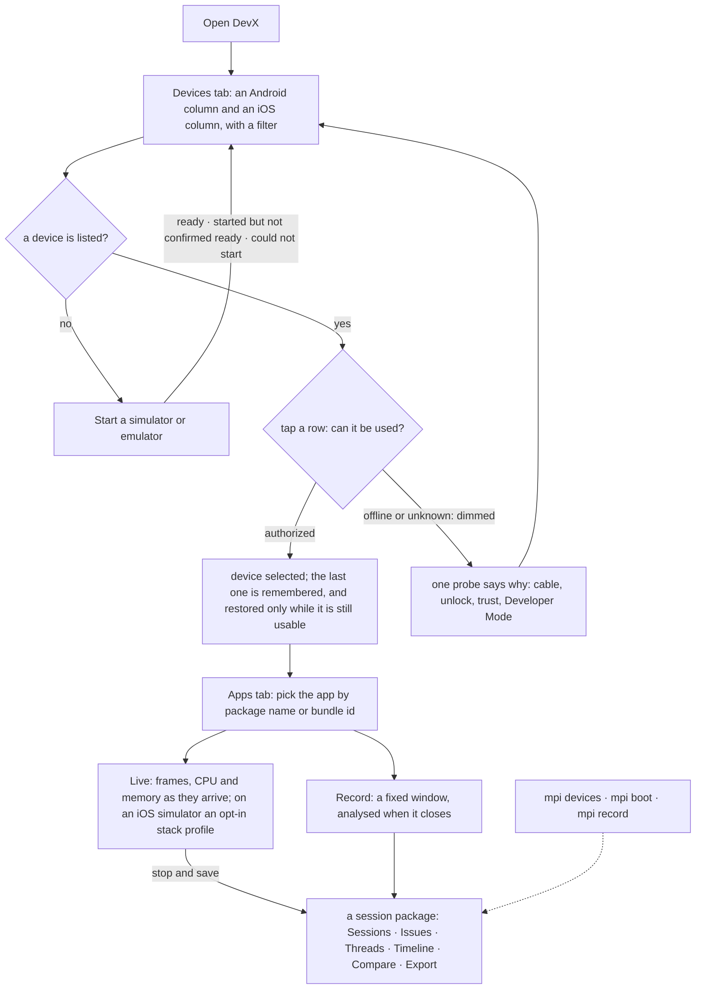
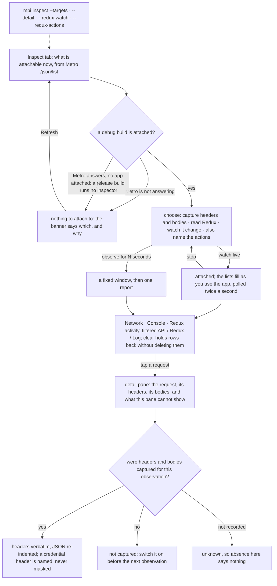
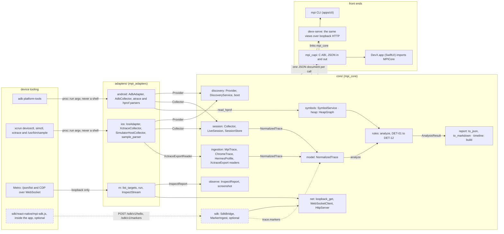

# Mobile Performance Inspector (`mpi`)

A cross-platform mobile performance profiler with a C++20 analysis core.

Implements **M0**, **M1** and **M2** on Android of
`MOBILE_PROFILER_IMPLEMENTATION_SPEC_EN.md` v2.0, which is not checked into this repository. On iOS the simulator streams through its own collector and a physical device records through `xctrace`, which has not completed a recording on this host.

Three pieces:

- **`mpi`** — the headless CLI.
- **`DevX.app`** — the native macOS desktop app (SwiftUI over a C ABI).
- **`devx-serve`** — the same views over loopback HTTP, for a host without
  SwiftUI.

> **Read this first.** Android live capture works and is verified against a
> real emulator. **iOS capture is partial**: a simulator streams in DevX's Live tab through its own collector (CPU time, memory footprint, per-thread times, optional stacks; no frames, because no command-line frame source exists), a physical device records through `xctrace`, which attaches on this host and has never finished, and no physical
> device of either platform was reachable during development, so the
> physical-device path is explicitly **unverified**. `mpi record` refuses to
> fabricate a capture. What works, what does not, and what was measured:
> [`docs/known-limitations.md`](docs/known-limitations.md) and
> [`docs/capabilities/tested-capability-matrix.md`](docs/capabilities/tested-capability-matrix.md).

---

## What works today

| | Android | iOS |
|---|---|---|
| Device discovery | ✅ `adb devices -l`, parsed and tested | ✅ `devicectl list devices` + `simctl`, verified against real output |
| Installed-app enumeration | ✅ verified on the emulator (`adb shell pm`; 265 apps listed) | ✅ verified on a booted simulator; ⚙️ physical path implemented, not verified |
| Running-process resolution | ✅ verified on the emulator (`adb shell ps`; every recorded capture resolved its target through it) | ✅ verified on simulator via launchd; ⚙️ physical path not verified |
| Selection by package name / bundle id | ✅ | ✅ |
| Ownership evidence + PID-reuse safety | ✅ | ✅ |
| Capability preflight | ✅ | ✅ |
| **Live capture** | ✅ verified on emulator (frames, CPU, memory) | ⚙️ `xctrace` collector wired; on this host it attaches and never finishes, so no recording has completed |
| **Realtime streaming** (open window, updates as they arrive) | ✅ verified on emulator: 62 ticks, frames + memory per tick, CPU in background windows | ✅ simulator, in DevX's Live tab: CPU time, memory footprint, per-thread times, optional stacks; no frames · ❌ physical device: `xctrace` yields a bundle only when it finishes, so there is nothing to stream |
| Offline analysis, issues, evidence | ✅ | ✅ |
| JSON / Markdown reports | ✅ | ✅ |
| Benchmark comparison engine | ✅ | ✅ |
| Desktop app (DevX) | ✅ | ✅ |
| Timeline view (states, not bare numbers) | ✅ | ✅ |
| Compare view (gate status before verdict) | ✅ | ✅ |
| **Inspect** (network, console, Redux through the app's own inspector) | ✅ verified against a real app on the emulator: 52 slices, headers and bodies, action diffs | ✅ simulator, over the same Metro socket; screenshot via `simctl`; no physical-device screenshot route exists |

✅ exercised against real tooling · ⚙️ implemented and unit-tested, awaiting hardware · ❌ not implemented

**A PID is never required.** Targets are selected by Android package name or
iOS bundle identifier, as spec section 1 requires.

---

## Build

Requirements: a C++20 compiler, CMake ≥ 3.24. No third-party libraries
([why](docs/adr/0002-zero-third-party-dependencies.md)), so no network access
is needed to build.

```bash
cmake -S . -B build -G Ninja -DCMAKE_BUILD_TYPE=RelWithDebInfo
cmake --build build
```

Run the tests (543 C++ cases in 23 binaries, plus 502 Swift checks and 78 smoke checks -- read these from the binaries rather than trusting this line: `for b in build/bin/test_*; do "$b"; done`, `./build/bin/devx_swift_tests`, `bash tools/smoke-test.sh`):

```bash
cd build && ctest --output-on-failure
```

Build with ASan + UBSan — development only, never for benchmark capture
(spec §15):

```bash
cmake -S . -B build-asan -G Ninja -DCMAKE_BUILD_TYPE=Debug -DMPI_ENABLE_SANITIZERS=ON
cmake --build build-asan && (cd build-asan && ctest --output-on-failure)
```

Artifacts land in `build/bin/`: `mpi`, `DevX.app`, `devx-serve`. Warnings are
errors by default (`-DMPI_ENABLE_WARNINGS_AS_ERRORS=OFF` to relax).

The SwiftUI app needs macOS with Swift and the macOS SDK; its build target
self-skips when either is missing, so the repository still builds elsewhere.

`cmake --build build --target devx_install` copies `DevX.app` where the Dock can find it, and `cmake --build build --target devx_dmg` builds `build/DevX.dmg` -- a compressed read-only image holding the app and a symlink to /Applications, so the download is produced the same way every time and the recipe is reviewable. The image is signed ad-hoc and not notarized: Gatekeeper refuses it on first launch with a message about an unverified developer or a "damaged" app, and it is neither. Right-click DevX in Applications and choose Open, once. `v0.1.0` is the first tagged release; `docs/RELEASE-v0.1.0.md` leads with that step because a download that will not open is the most common way a tool like this is written off as broken. Apple Silicon only, macOS 14 or newer.

### Platform prerequisites

Only needed for live discovery, not for offline analysis.

- **Android** — Android SDK Platform Tools on `PATH`; USB debugging enabled and
  authorized on the device.
- **iOS** — macOS with Xcode installed and selected (`xcode-select -p`). A
  physical device must be unlocked, trusted, and have Developer Mode enabled;
  Xcode must have prepared its developer disk image (the tool reports
  `ddiServicesAvailable: false` when it has not).
- **iOS sampling through Instruments** needs Full Disk Access for whatever runs the tool, because Instruments samples through the unified log store and `/var/db/diagnostics` is not readable without it. Without it `xctrace` reports that "the log archive is corrupt or incomplete", which is not what is wrong. Preflight probes this as `ios.capture.log_store` -- one `log show --last 1s`, reported as available or permission_denied, never unknown -- so the problem is found before a capture is.

---

## DevX, the desktop app

```bash
open build/bin/DevX.app

# or open a specific session straight from the CLI
open -a "$PWD/build/bin/DevX.app" --args --session=<session-id>

# or start streaming a live capture on launch
open -a "$PWD/build/bin/DevX.app" --args \
  --device=<id> --app=<identifier> --start-live
```

The window is rendered entirely in **Menlo** -- the face Terminal and Xcode are
read in, which ships with every macOS, so nothing is bundled and the licence
inventory stays empty. `--font=<family>` switches it (`--font=Monaco` for the
older Mac terminal face, or any coding font you have installed); a family that
is not installed is reported on stderr and the default is kept.

Write launch options as `--flag=value`. The space-separated form works too,
but AppKit pairs arguments differently than DevX does and can be left holding
a bare one, which it treats as a file to open -- see
[known limitations §5](docs/known-limitations.md).

Native sidebar over Devices · Apps · Preflight · **Live** · Record · **Inspect** · Sessions ·
Issues · Threads · Timeline · Compare · Detectors · Export. The Live tab streams a capture alongside the running app --
frame and sample counts, memory sparklines per family, per-source status, and a
preliminary banner over all of it until the window closes. It renders the engine's output and nothing more: the provenance
banners, the separate detection and cause columns, the severity rationale and
the detector-execution table are all the model's own fields, so the UI cannot
present a softer story than the analysis.

Two journeys leave the Devices tab. Live and Record need a usable device and an
app identifier and end in a session package on disk:



Inspect needs neither, because it reads the inspector a React Native debug build
already runs, found through Metro's `/json/list`; a release build gives it nothing
to attach to. An observation is a debugger session, not a measurement, and the
pane says on every selection what it cannot show:



On a host without SwiftUI, `devx-serve` serves the same views over loopback
HTTP (127.0.0.1 only, token required per start).

The Inspect tab is `mpi inspect` with the window left open while you use the app: the network, console and Redux lists on the left, and a detail column on the right in an `HSplitView`, so selecting a request shows its headers and body without pushing the next row off the screen. A JSON body is re-indented, not re-serialised: the formatter changes only the whitespace between tokens, because a parse-and-print would turn `1.0` into `1` and drop a duplicate key, and the one thing this pane is for is the body that arrived. A row whose detail was never captured says so -- six states, kept apart -- and what the pane cannot show is stated on every selection rather than left as an empty tab. Redux watching and action naming are toggles beside the list, with the same warning the CLI prints, and `clear` on each list is a watermark rather than a delete: the rows stay in the observation and in an export.

The Devices tab filters on name, id, model, OS, platform and form -- trust is deliberately not searchable, because typing "offline" and hiding every device that works is worse than matching nothing -- and splits the list into an Android column and an iOS column, both always present even when empty, because "no Android device is connected" is a real answer a mixed list could not give. Each column reports what the filter hid from its own platform. Column width follows the device count with a floor, so one emulator beside twenty-five simulators no longer leaves half the window empty. A platform nobody anticipated gets its own column under the provider's name, and a device with no platform goes to its own bucket rather than being guessed into one; dropping a device would be the one unrecoverable mistake this view could make.

On an iOS simulator the Live tab offers a stack-profile checkbox with a seconds stepper. It runs `/usr/bin/sample` against the app's host process and ingests the call graph as weighted CPU samples, so a simulator capture has stack attribution as well as CPU time. It is opt-in for two reasons the warning beside it states: `sample` blocks for the seconds it samples, so the stop waits; and what it returns is an aggregate with no timestamps, which says where the samples were and never when -- nothing from it may be put on a timeline.

The interface is available in English and Vietnamese, chosen from the Language menu or the Export tab, or left on System to follow the Mac's preferred languages. The catalog is keyed by the English sentence rather than by an identifier, so a missing translation degrades to correct English rather than to a key on screen. Technical terms stay in English on purpose.

## Use

```bash
mpi devices                                    # discover Android + iOS devices
mpi apps --device <id> --running                # enumerate apps on one device
mpi preflight --device <id> --app <identifier>  # probe capabilities for a target
mpi record --device <id> --app <identifier>     # record a capture
mpi record --app <identifier> --live --tick-ms 500  # stream until Ctrl-C, one line per tick
mpi analyze <session|trace>                     # analyze and report
mpi compare <baseline.json> <candidate.json>    # compare two run sets
mpi rules                                       # describe every detector
mpi sdk-bridge                                  # accept SDK markers without recording
mpi export <session> --format json              # re-export a session
```

Add `--json` for machine-readable output, `--ci` to forbid prompting and
inferred targets. An unknown flag is a usage error rather than being ignored:
a flag that was silently dropped would change what got measured without saying
so.

`--live` keeps the window open until stopped, printing a line per tick with
its own cost. Frames and memory arrive on the tick; CPU arrives in background
windows because `simpleperf` costs about 5.6 s per record-and-symbolise cycle,
and the intervals between those windows are recorded as coverage gaps, not as
measured idle time. Without `--live`, `--duration-s` records a fixed window.

```bash
mpi inspect --targets                          # what is attachable, without attaching
mpi inspect --app <identifier> --seconds 15     # network calls, console output, exceptions
mpi inspect --app <identifier> --detail         # plus request/response headers and bodies
mpi inspect --app <identifier> --redux --redux-watch   # the store's slices, and every change to them
mpi inspect --app <identifier> --device <id> --screenshot
```

`inspect` reads the inspector a React Native debug build already runs and connects to Metro -- nothing is added to the app. It is not a performance measurement: a debugger is attached, and the report says so. `--detail` is off by default because that is where the bearer tokens are; values are kept verbatim rather than redacted, so the decision is whether to capture them at all. `--redux-watch` is read-only, through `store.subscribe`, and names no action because Redux passes subscribers none; `--redux-actions` also wraps `store.dispatch`, which modifies the running app for the window and is put back afterwards -- a dispatch reference captured beforehand, as a thunk's is, still bypasses it, and such a change is reported as unnamed rather than misattributed. `--screenshot` requires `--device`; the id is translated to the name Metro publishes. One Metro serves every attached device, so `--target-device` picks which.

### Exit codes

| Code | Meaning |
|---|---|
| 0 | ok |
| 2 | usage error |
| 3 | regression detected |
| 4 | inconclusive — including "every detector was skipped" |
| 5 | collection error |
| 6 | unsupported operation |
| 7 | ambiguous target |
| 8 | cancelled |
| 9 | not found |

`3` and `4` are deliberately distinct: a comparison that could not establish
anything is not a pass.

### Try it without a device

```bash

```bash
mpi boot --list                                # simulators and AVDs that can be started
mpi boot --device <avd|udid> --ready-timeout-s 180   # start one; "started" and "ready" are reported separately
mpi timeline <session|trace> --bins 40         # the capture's tracks; a blank column means NOT MEASURED, never zero
```

`boot` reports "started" and "ready" as two facts, because a device that has appeared is not yet one that answers. A budget bounds when the call returns, not when the last poll may start, and three unanswered polls in a row are reported as a tooling failure -- naming `sudo pkill -f CoreSimulatorService` or `adb kill-server` -- rather than as a device that never came up. `timeline` re-reads the whole trace; DevX refuses inputs above 256 MiB and `--max-input-mib` is how you say you have the room.
# A positive fixture: frame misses, a long JS task, a CPU hotspot, tooling cost
./build/bin/mpi analyze fixtures/traces/positive-frames-js-cpu.mpi.json

# A healthy capture: detectors RUN and find nothing (not the same as not running)
./build/bin/mpi analyze fixtures/traces/negative-healthy.mpi.json

# Incomplete evidence: proxy frames, unmapped clock, too few samples, drops
./build/bin/mpi analyze fixtures/traces/incomplete-evidence.mpi.json

# Real third-party formats
./build/bin/mpi analyze fixtures/traces/hermes-profile.json
./build/bin/mpi analyze fixtures/traces/chrome-trace-event.json
```

The three `.mpi.json` fixtures are labelled `synthetic` and their reports say so at the top. The Hermes and Chrome files are third-party formats with no such field, so their reports carry no banner; they exercise the reader, and nothing in them was measured on a device either.

---

## The in-app SDK

Screens, navigations, interactions and the build handshake come from the app
itself -- no device provider can see them, and a screen is never guessed from a
function name. `sdk/react-native/mpi-sdk.js` is dependency-free ES module
JavaScript with no build step; see
[its README](sdk/react-native/README.md).

```bash
mpi record --device <id> --app <identifier> --sdk --duration-s 20
# prints: SDK endpoint http://127.0.0.1:60773 token e5c7675b...
#         let the device reach it: adb reverse tcp:60773 tcp:60773
```

The endpoint binds 127.0.0.1 and requires that token on every request. A lost
batch becomes a recorded gap rather than silence, and a capture with no SDK
reports that it has no screen or interaction evidence instead of leaving the
fields quietly empty.

## Layout



Device tooling on the left is run through proc::run with an argv and never a shell; the adapters turn its text output into one NormalizedTrace, and everything downstream of the model reads that trace and never asks the device again. The core is exposed three ways: the mpi CLI, devx-serve over loopback HTTP, and DevX.app, which reaches it only through the mpi_capi C ABI as JSON strings. The rn path attaches a debugger to observe network, console and Redux and is not a performance measurement; the in-app SDK is optional, and without it the screen and interaction fields stay empty. The diagram is Mermaid source, not an image: ADR-0002 keeps binary assets out of the tree, and GitHub renders the fence.

```
apps/cli/            the `mpi` command-line interface
apps/devx-mac/       DevX.app -- native SwiftUI desktop app, over the C ABI
apps/devx-serve/     the same views over loopback HTTP, for a host without SwiftUI
core/capi/           the C ABI DevX is built on
core/
  model/             normalized trace, identity, capability, build, issue contracts
  discovery/         provider interface, reconciliation across adapters, boot
  ingestion/         readers (native, Chrome trace-event, Hermes profile, xctrace export) + normalization
  symbols/           source maps, R8 mappings, path-traversal defence
  rules/             detector contract, registry, all twelve detectors
  report/            JSON and Markdown writers
  session/           session package on disk, collector contract, comparison
  timeline/          binned tracks whose bins carry a state, not a bare number
  heap/              object graph from a heap dump + reference-path search
  observe/           reading a running app: network, console, Redux, screenshots
  net/               a WebSocket client, one loopback HTTP GET, and the HTTP server devx-serve uses
  sdk/               the optional in-app SDK's side of the wire, and its loopback endpoint
  util/              JSON, process execution, cancellation, time
adapters/android/    adb adapter, live capture collector, atrace and HPROF parsers
adapters/ios/        devicectl / simctl / xctrace adapter, simulator host collector, `sample` call-graph parser
adapters/rn/         a React Native app's own inspector, reached through Metro
sdk/react-native/    the in-app SDK: markers, build handshake, transport (optional)
sdk/ios, sdk/android READMEs only -- each says why no native SDK is shipped
samples/react-native a two-screen app with the SDK wired in, to be copied from
fixtures/
  traces/            labelled synthetic traces (positive, negative, incomplete, malformed), three *.real.mpi.json emulator captures, Hermes / Chrome format samples
  provider-output/   *.real.* = genuine tool output; *.synthetic.* = hand-written
  symbols/           source maps and R8 mappings, including hostile ones
  runsets/           baseline and candidate run sets for `mpi compare`
  cdp/               a real recorded inspector session (one value redacted, noted in its header)
  sample/            a real `/usr/bin/sample` call graph from a simulator
tests/unit, tests/integration, tests/helpers (a devicectl stand-in and two deliberately misbehaving tools)
tools/               check-i18n, gen-requirement-map, gen-icon, gen-stress-fixture, smoke-test
docs/adr/            architecture decision records
docs/capabilities/   tested capability matrix, iOS toolchain probe record
```

## Documentation

- [Known limitations](docs/known-limitations.md) — what is not true of this build
- [Packaging, signing and licenses](docs/packaging-and-signing.md) — ad-hoc signed; what shipping would take
- [Tested capability matrix](docs/capabilities/tested-capability-matrix.md) — measured probe results
- [iOS toolchain probe record](docs/capabilities/ios-toolchain-probe.md) — the M0 schema validation
- [Requirement → test map](docs/requirement-test-map.md) — 177/198 checklist items, with reasons for the rest
- [Milestone report](docs/milestone-report.md) — M0/M1 in the format spec §21 asks for
- [Third-party licenses](THIRD-PARTY-LICENSES.md) — empty, deliberately
- ADRs: [core](docs/adr/0001-cplusplus-core-and-normalized-model.md) ·
  [no deps](docs/adr/0002-zero-third-party-dependencies.md) ·
  [no shell](docs/adr/0003-no-shell-argv-only-process-execution.md) ·
  [UI seam](docs/adr/0004-defer-the-desktop-ui-and-fix-the-seam.md) ·
  [honesty by types](docs/adr/0005-conservative-by-construction-model.md) ·
  [Android text sources](docs/adr/0006-android-text-sources-not-perfetto.md) ·
  [DevX in SwiftUI](docs/adr/0007-devx-is-a-native-swiftui-app.md)

- [Inspecting without installing](docs/inspect-without-installing.md) — how `mpi inspect` reads a debug build's inspector, and what it cannot reach
- [iOS: what works, what does not, and what was measured](docs/ios-live-capture-findings.md) — the simulator collector, the mach-unit trap, why the "corrupt log archive" was a permission
- [Release notes v0.1.0](docs/RELEASE-v0.1.0.md) — install, the Gatekeeper step, known limits
- [More than one language](docs/internationalisation.md) — English and Vietnamese; the catalog is keyed by the English text

## How to read a report

- `observed` means measured. `suspected` means the evidence is indirect or came
  from a proxy source. `inconclusive` means the detector could not decide.
- **Detection status and cause status are separate.** A measured symptom with
  `cause_status: unknown` is the normal, honest result.
- Severity orders impact. It is not confidence in a cause.
- A temporal correlation is a `candidate` cause, never a proven one.
- Missing data is a **gap**. It is never reported as zero.
- A `skipped` detector found nothing *because it did not run*. That is not the
  same statement as "no issue exists".
