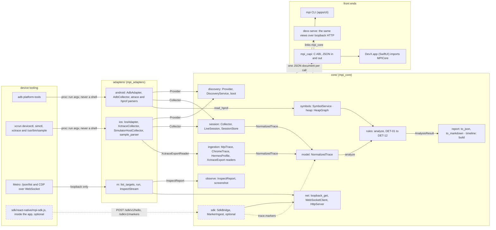

# Architecture

How DevX is put together. For using it, see the [README](../README.md); for
building it, [building from source](building.md).

## Layout



Device tooling on the left is run through proc::run with an argv and never a shell; the adapters turn its text output into one NormalizedTrace, and everything downstream of the model reads that trace and never asks the device again. The core is exposed three ways: the mpi CLI, devx-serve over loopback HTTP, and DevX.app, which reaches it only through the mpi_capi C ABI as JSON strings. The rn path attaches a debugger to observe network, console and Redux and is not a performance measurement; the in-app SDK is optional, and without it the screen and interaction fields stay empty. The diagram is Mermaid source, not an image, so it changes in the same diff as the code it describes, and GitHub renders the fence.

```
apps/cli/            the `mpi` command-line interface
apps/devx-mac/       DevX.app -- native SwiftUI desktop app, over the C ABI
apps/devx-serve/     the same views over loopback HTTP, for a host without SwiftUI
core/capi/           the C ABI DevX is built on
core/
  model/             normalized trace, identity, capability, build, issue contracts
  discovery/         provider interface, reconciliation across adapters, boot
  ingestion/         readers (native, Chrome trace-event, Hermes profile, xctrace export) + normalization
  symbols/           source maps, R8 mappings, path-traversal defence
  rules/             detector contract, registry, all twelve detectors
  report/            JSON and Markdown writers
  session/           session package on disk, collector contract, comparison
  timeline/          binned tracks whose bins carry a state, not a bare number
  heap/              object graph from a heap dump + reference-path search
  observe/           reading a running app: network, console, Redux, screenshots
  net/               a WebSocket client, one loopback HTTP GET, and the HTTP server devx-serve uses
  sdk/               the optional in-app SDK's side of the wire, and its loopback endpoint
  util/              JSON, process execution, cancellation, time
adapters/android/    adb adapter, live capture collector, atrace and HPROF parsers
adapters/ios/        devicectl / simctl / xctrace adapter, simulator host collector, `sample` call-graph parser
adapters/rn/         a React Native app's own inspector, reached through Metro
sdk/react-native/    the in-app SDK: markers, build handshake, transport (optional)
sdk/ios, sdk/android READMEs only -- each says why no native SDK is shipped
samples/react-native a two-screen app with the SDK wired in, to be copied from
fixtures/
  traces/            labelled synthetic traces (positive, negative, incomplete, malformed), three *.real.mpi.json emulator captures, Hermes / Chrome format samples
  provider-output/   *.real.* = genuine tool output; *.synthetic.* = hand-written
  symbols/           source maps and R8 mappings, including hostile ones
  runsets/           baseline and candidate run sets for `mpi compare`
  cdp/               a real recorded inspector session (one value redacted, noted in its header)
  sample/            a real `/usr/bin/sample` call graph from a simulator
tests/unit, tests/integration, tests/helpers (a devicectl stand-in and two deliberately misbehaving tools)
tools/               check-i18n, gen-requirement-map, gen-icon, gen-stress-fixture, smoke-test
docs/adr/            architecture decision records
docs/capabilities/   tested capability matrix, iOS toolchain probe record
```

## Design notes: the DevX screens

Why some screens behave the way they do. Each of these is a decision a reader
of the code would otherwise have to reconstruct.

The Inspect tab is `mpi inspect` with the window left open while you use the app: the network, console and Redux lists on the left, and a detail column on the right in an `HSplitView`, so selecting a request shows its headers and body without pushing the next row off the screen. A JSON body is re-indented, not re-serialised: the formatter changes only the whitespace between tokens, because a parse-and-print would turn `1.0` into `1` and drop a duplicate key, and the one thing this pane is for is the body that arrived. A row whose detail was never captured says so -- six states, kept apart -- and what the pane cannot show is stated on every selection rather than left as an empty tab. Redux watching and action naming are toggles beside the list, with the same warning the CLI prints, and `clear` on each list is a watermark rather than a delete: the rows stay in the observation and in an export.

The Devices tab filters on name, id, model, OS, platform and form -- trust is deliberately not searchable, because typing "offline" and hiding every device that works is worse than matching nothing -- and splits the list into an Android column and an iOS column, both always present even when empty, because "no Android device is connected" is a real answer a mixed list could not give. Each column reports what the filter hid from its own platform. Column width follows the device count with a floor, so one emulator beside twenty-five simulators no longer leaves half the window empty. A platform nobody anticipated gets its own column under the provider's name, and a device with no platform goes to its own bucket rather than being guessed into one; dropping a device would be the one unrecoverable mistake this view could make.

On an iOS simulator the Live tab offers a stack-profile checkbox with a seconds stepper. It runs `/usr/bin/sample` against the app's host process and ingests the call graph as weighted CPU samples, so a simulator capture has stack attribution as well as CPU time. It is opt-in for two reasons the warning beside it states: `sample` blocks for the seconds it samples, so the stop waits; and what it returns is an aggregate with no timestamps, which says where the samples were and never when -- nothing from it may be put on a timeline.

## Architecture decision records

- [ADR-0001 C++ core and a normalized model](adr/0001-cplusplus-core-and-normalized-model.md)
- [ADR-0002 No third-party libraries](adr/0002-zero-third-party-dependencies.md)
- [ADR-0003 No shell: argv-only process execution](adr/0003-no-shell-argv-only-process-execution.md)
- [ADR-0004 Defer the desktop UI and fix the seam](adr/0004-defer-the-desktop-ui-and-fix-the-seam.md)
- [ADR-0005 Conservative by construction](adr/0005-conservative-by-construction-model.md)
- [ADR-0006 Android text sources, not Perfetto](adr/0006-android-text-sources-not-perfetto.md)
- [ADR-0007 DevX is a native SwiftUI app](adr/0007-devx-is-a-native-swiftui-app.md)
