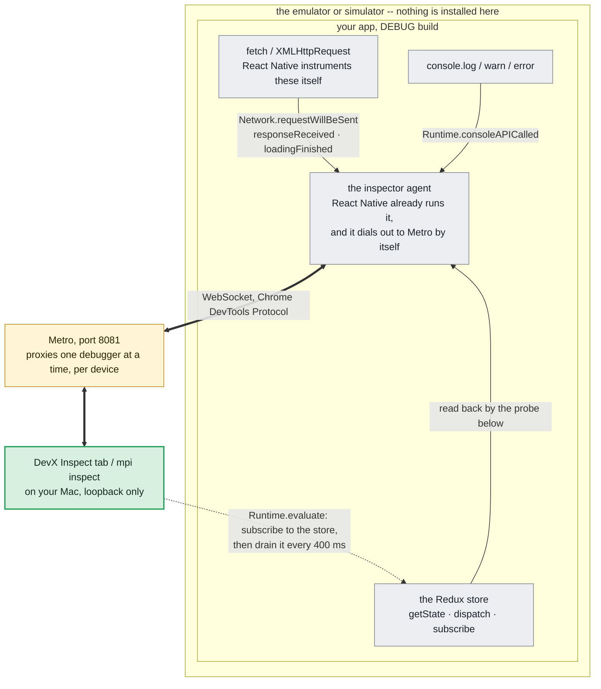
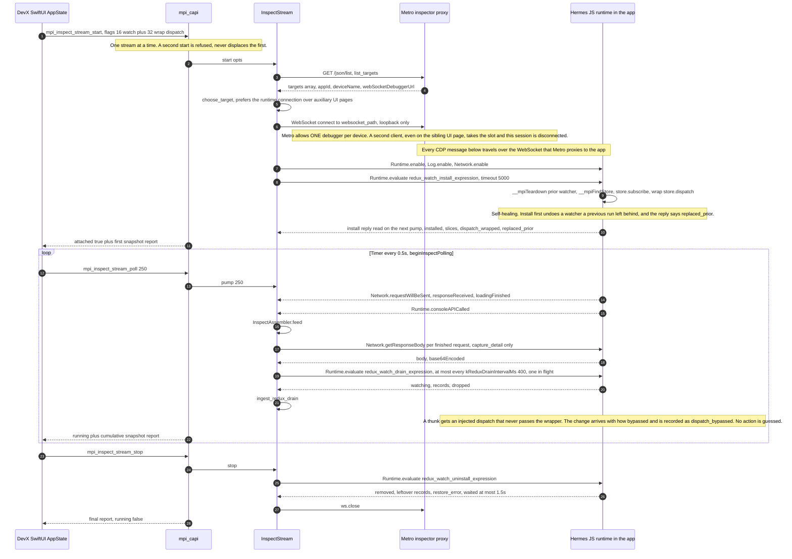

# Reading a running app without installing anything in it

Reactotron, Flipper and every tool like them work the same way: the app
imports a client, the client opens a socket, and the tool on your machine
talks to it. That means a dependency, an import, a rebuild, and a decision
about whether it ships in release.

`mpi inspect` needs none of that. It reads a connection the app already has.

## Why this is possible



The app is already talking to Metro before this tool starts: a React Native
debug build runs an inspector agent and dials out to it by itself. Metro
proxies a Chrome DevTools Protocol session over one WebSocket, and that is
the whole mechanism -- nothing is added to the app, and a release build,
which runs no agent, offers nothing to attach to.

Two of the three streams the app pushes: React Native instruments its own
`fetch`/`XMLHttpRequest`, and `console.*` arrives as `consoleAPICalled`.
Redux is the exception and is drawn as a dotted line for that reason -- the
app broadcasts nothing about its store, so the store is read back by a probe
this tool evaluates inside the running app and drains on a timer.


A React Native **debug** build runs an inspector and connects itself to Metro.
It is how "press `j` to open React Native DevTools" works. Metro proxies a
Chrome DevTools Protocol session over a WebSocket, and CDP already carries
what a tool like Reactotron asks the app to send it.

Measured against a real app (Shopper debug build, Android emulator) rather than
assumed:

| What | Where it comes from | Result |
|---|---|---|
| HTTP calls | `Network.requestWillBeSent` / `responseReceived` / `loadingFinished` | method, URL, status, bytes, duration |
| console output | `Runtime.consoleAPICalled`, `Log.entryAdded` | level, arguments, source location |
| JS exceptions | `Runtime.exceptionThrown` | message and stack |
| Redux **state** | `Runtime.evaluate`, walking React's own devtools hook | the store's slices, and its values on request |
| request **detail** | headers from the events, bodies via `Network.getResponseBody` | request and response headers, request body, response body |

The Redux part is the surprising one. `__REDUX_DEVTOOLS_EXTENSION__` is not
present in a React Native app and there is no global `store`, but
`__REACT_DEVTOOLS_GLOBAL_HOOK__` is — it is how React DevTools finds anything
— and from it the fiber tree can be walked to a component prop carrying
`getState`, `dispatch` and `subscribe`. That is a Redux store. On the app this
was built against it was found 23 fibers in, with 52 slices.

The walk is **read-only** and bounded to 4000 fibers. Nothing is assigned,
wrapped or dispatched: a profiler that stalls the app it is measuring has
failed at its own job.

## Choosing which device

One Metro serves every device you have running, so the same bundle id is
routinely attached from several at once -- an Android emulator and an iOS
simulator, say. `--target-device` names which, matched case-insensitively
as a substring of Metro's own device name, or as a prefix of its device key
(described below; Metro reports no adb serial and no simulator UDID):

```bash
mpi inspect --targets                                  # see the device names
mpi inspect --app <id> --target-device iPhone          # the iOS one
mpi inspect --app <id> --target-device sdk_gphone      # the Android one
```

With several devices attached and no name given, the command **refuses and
lists them** rather than choosing. That is not pedantry: before this existed,
asking for an app attached from both an emulator and a simulator always
observed the Android one, silently, and the iOS device could not be reached at
all. Reporting one device's traffic under the right app's name is exactly the
kind of quiet substitution this tool exists not to make.

A name that matches nothing is also refused, with the attached devices listed,
rather than falling back to the only device and presenting it as the one
asked for.

**Device names are not unique**, which is why the grouping is not done by
name. Two simulators of the same model on different runtimes both report
`iPad (A16)` -- verified in the local simulator list: UDIDs `7ABCF841…` on iOS
18.6 and `1909934C…` on iOS 26.5. Metro publishes a per-device identity in the
`device=` parameter of its debugger URL, and that is what devices are grouped
by; the two entries Metro lists for one device (a runtime connection and an
auxiliary page) share it. Where two devices *do* share a name, the listing
appends enough of that key to tell them apart, and the key can be used as the
hint:

```bash
mpi inspect --app <id> --target-device key26bb     # when the name is ambiguous
```

## Using it

```bash
mpi inspect --targets                    # what is attachable, without attaching
mpi inspect --app <id> --seconds 15 --redux
mpi inspect --app <id> --device emulator-5554 --screenshot
```

Or the **Inspect** tab in DevX, which shows the same observation, lets the
window run while you use the app, and opens one request's headers and body in
a pane beside the list (see "Request detail" below).

Each of the three lists in DevX -- network, console, Redux activity -- has its own `clear`, and a clear is a watermark, not a delete. The rows stay in the observation and in an export; the list says how many it is holding back and offers them back. A delete would also not survive the next poll: the assembler is cumulative and hands back the whole observation each time, so removed rows would return on the next tick. Network and console are marked by count because those lists are append-only; Redux records are marked by sequence number, because the in-app buffer drops its oldest under load and a count would then hide the wrong rows.

Each list scrolls inside a section capped at 280 points, so the page fits one screen. Nothing is hidden by the cap, and the section title carries the count, so the height makes no claim about how many rows there are.

## Request detail

Reactotron shows a request's headers and bodies, and so does this -- with
nothing installed. Headers arrive in the events themselves; the response body
needs a separate `Network.getResponseBody` call per request, which the session
issues as each request finishes.

```bash
mpi inspect --app <id> --target-device iPhone --detail
```

Verified over the inspector socket: `getResponseBody` returned
`cGFja2FnZXItc3RhdHVzOnJ1bm5pbmc=` with `base64Encoded: true`, which decodes
to `packager-status:running` -- a real response body from a live app.

**Off by default, and that is not timidity.** An `Authorization` header
carries a bearer token and a login response carries whatever the login
returned. This is the data *in flight*, which is more sensitive than the Redux
store's data at rest, and it lands in a report that can be exported. Values
are kept **verbatim** rather than redacted, because a redacted header is a
claim about what was sent that is not true -- so the decision is whether to
capture it at all.

The encoding flag travels with every body. The runtime decides text versus
base64, and a reader that decodes text as base64 gets nonsense.

"There is no body" and "the body could not be fetched" are the same error from
the runtime -- `Internal error: Could not retrieve response body` -- and they
are different facts. Where the exchange settles it (a HEAD, a 204 or 304, or
`Content-Length: 0`) it is reported as having no body by construction, because
the raw error reads as a failure for a response that was never going to carry
content.

In DevX the list and the detail sit side by side. The tab is a split pane: the observation on the left, one request on the right, each column in its own scroller. Clicking a row opens it, and the detail is stacked sections -- the request, its headers, its bodies -- rather than a DevTools tab strip. A tab is visible whether or not anything is behind it, so an empty Timing tab would answer "this request had no timing" when the truth is that nothing here measured it. What the pane cannot show is stated on every selection instead, unconditionally: no timing breakdown, no cookies (the inspector reports an empty cookie list for every request, so nothing distinguishes that from a request that sent none), no initiator.

Selection is keyed by `request_id`, never by a row index. The rendered list is what a clear left and then what the filter left, and both shift every offset, so an index-keyed selection would land on a different request -- in a pane whose whole job is one request's headers and body, the worst available failure. A request that is selected but not in the list gets its own sentence for each reason -- hidden by the filter, held back by clear, or gone because the app reloaded and the observation started over -- because clear and the filter are separate ideas with separate controls, and "pick a request" said about a request the reader had already picked would be blaming them for the filter.

A body has more states than present and absent, and the first version of the pane collapsed them. `response_body` is optional in the core and the key is emitted only when it holds a value, so one emptiness test read three facts as one: detail was never captured, the runtime had nothing to give, and a real captured zero-byte body. All three rendered as nothing. They are six states now -- not captured, unavailable with the runtime's own reason, empty, base64, JSON, text -- and each is something the data positively said. A request still in flight, or one that failed, was never asked for a body at all, so on those rows the cause is in the document and is not blamed on a setting.

JSON is re-indented, and the re-indent changes whitespace only. The obvious implementation -- parse the body and print it back -- quietly changes the data. Measured with Foundation on this machine: `{"v":1.0}` comes back as `{"v": 1}`, so a server that sent 1.0 reads as having sent 1, and `{"a":1,"a":2}` comes back as `{"a": 1}`, so a duplicate key disappears. Neither is a disaster alone, and both make the document on screen something other than the response body, which is the one thing the pane is for. So Foundation's parser decides only whether the text is JSON, and every token is then re-emitted byte for byte with only the whitespace between tokens changed. Key order is kept for the same reason: sorting would make two captures of one endpoint easier to compare, and it would also mean the document on screen is not the document that arrived. The invariant is tested directly: stripping whitespace outside strings from the output gives the input's own normal form, across eighteen shapes including an integer past 2^53, an escaped slash and braces inside a string. A base64 body is shown as it arrived rather than decoded, because decoding it here would destroy the distinction the runtime drew.

A body over 20,000 characters is shown in steps, with the cut stated: a body silently shortened reads as a body that was that short. The raw bytes are kept beside the formatted view, because a pretty-printer that loses the original is a pretty-printer you cannot check.

Nothing is masked in the pane, for the reason above, and because half the people opening it are debugging an auth problem and need the token that was actually sent. What is added is one line above a header list naming which of the headers present are the kind that usually carry a credential -- `authorization`, `cookie`, `x-api-key` and the like -- so the reader knows before they screen-share, not after. Names only, never a value; hedged as "usually carry" because "key" and "token" are also ordinary parameters; and matched on the whole name, so `x-monkey-id` is not flagged for containing "key", since a warning that fires on the wrong thing gets ignored on the right one.

Whether detail was captured is recorded when an observation starts, not read from the live toggle. The toggle governs the next capture, and reading it to describe the document already on screen meant that switching it off made the pane claim the bodies it was displaying had never been captured. The report itself carries no such flag, so when there is no record the answer is unknown, and the pane says so rather than making a negative claim about someone else's data.

## What it does not reach

Four limits, three of them here; the fourth -- what Redux does and does not expose -- has its own section below. Each one is the difference between "we saw nothing" and the false
claim "nothing happened", so they are carried in the report's `caveats` array
and printed under **WHAT THIS DOES NOT SHOW** — not left in this document.

**It needs the inspector.** A release build runs none. There is no target to
attach to, which is a missing provider and not a quiet app. `mpi inspect
--targets` says which of the two you are looking at.

**Network coverage is the JavaScript side only.** These events come from React
Native's own fetch/XHR instrumentation. HTTP performed by a native module
through OkHttp, or an image fetched by the platform's loader, never appears.
An empty list does not mean the app made no requests.

The case that catches people is a **WebView**, because most SSO and payment
flows are one. Measured on a React Native app's single sign-on screen:
tapping into the form, typing a user id and submitting it produced **no
network entry at all** over five polls, while the only entry that ever
appeared was the app's own periodic `generate_204` connectivity probe. The
WebView's requests are native, and nothing about them reaches the JavaScript
inspector.

So an empty Network list on a login screen is normal and says nothing about
the app. The app's own API calls appear once it is past SSO and calling its
endpoints from JavaScript. The source status, the caveat and DevX's empty-list message all
name WebView for this reason; the CLI's empty-list line names only a native
module.

There is no no-install route to native traffic on a stock emulator: `adb root`
is refused on a production build (`adbd cannot run as root in production
builds`), so packet capture is not available either, and a proxy would mean
installing a certificate on the device.

**Attaching is not free.** A debugger session changes what the runtime does;
Hermes may deoptimise. Nothing in an inspect report is offered as a
performance measurement, which is also why this is a separate command from
`record` rather than another source inside it.

## Redux: two tiers, claiming different things

A list of slice names answers "is Redux here". The question people actually
bring to Reactotron is "what just happened, and what did it change" — and
getting there means being exact about which half of that is observable
without touching the app.

**State changes are observable read-only.** `store.subscribe` is a public API
— it is how react-redux itself watches the store — and it fires after every
dispatch. `--redux-watch` installs one listener, compares the top-level keys
by reference on each notification, and removes the listener at the end.

Reference comparison is Redux's own contract, not a shortcut: a reducer that
did not touch a slice returns the same object, which is exactly the signal
react-redux relies on. An app whose reducers mutate state in place breaks that
contract and its changes are invisible here; that is a limit of the app's
reducers, and it is stated here because the report cannot state it: a
mutated slice is indistinguishable from an untouched one.

What a subscriber does **not** receive is the action. Redux passes subscribers
no arguments at all, so a read-only record names a change and never an action.

**Action types and payloads require wrapping `dispatch`.** There is no
read-only route to them. `--redux-actions` replaces `store.dispatch` with a
wrapper that records the action and calls through, and puts the original back
when the capture stops. This modifies the running app for the duration, which
is the one thing the rest of this feature avoids — so it is opt-in, it is
stated in the report, and the report says whether the removal was confirmed.

Two honest limits on it:

- The wrapper sits on the `dispatch` **property** of the store object, so it
  sees calls made through it and misses any reference captured beforehand.
  Redux Toolkit hands thunks a `dispatch` from the middleware chain built when
  the store was created, so everything a thunk dispatches reaches the reducers
  without passing the wrapper. Such a change is recorded as
  `dispatch_bypassed` — a real change whose action is not named — rather than
  as a record that looks like the read-only case.
- If the socket dies before the capture stops, the wrapper is still installed.
  The buffer it writes into is bounded for that reason, and the next capture
  removes what it finds before installing its own. Verified: a run that was
  kicked off its debugger slot left a wrapper behind, and the next run
  reported "a watcher from an earlier run was still installed and was removed
  first".

The in-app buffer holds 200 records between drains by default. `--redux-buffer` sets it, and the number is clamped to at most 2000 inside the app, because it becomes an allocation bound in someone else's runtime. The buffer is emptied every 400ms while the capture runs -- fast enough that a tap's actions appear while the finger is still on the screen, slow enough that a quiet app is not paying for an evaluate four times a second -- and the final records come back with the uninstall, so a capture that stops right after a dispatch does not lose it. A burst larger than the buffer drops the oldest records and the count is reported: a tail that says it is a tail, rather than a short list that looks complete.

Removal has one deliberate exception. If something else replaced `dispatch` after this wrapper was installed, the saved original is not written back: overwriting a later wrapper would remove someone else's instrumentation, which is a worse outcome than leaving ours in place. The report carries that as the reason the removal did not happen, rather than reporting it as confirmed.

### Verifying this against a real app

Worth writing down, because it cost an hour: **Metro's inspector proxy allows
one debugger per device, not per page.** Opening a second CDP connection --
even to the sibling `UI` page of the same runtime -- takes the slot and the
first client is disconnected. The report says so honestly ("the app closed the
debugger connection ... It ran for 4194ms of the 12000ms asked for"), which is
what made the cause findable.

So a capture cannot be driven from a second socket. Drive the app itself
instead:

    xcrun simctl openurl <udid> <scheme>://

A deep link triggers real navigation and real dispatches while `mpi inspect`
keeps its slot. The app's URL schemes are in its bundle:

    /usr/libexec/PlistBuddy -c "Print :CFBundleURLTypes" \
      "$(xcrun simctl get_app_container <udid> <bundle-id>)/Info.plist"

### What a record carries

The app sends the changed slices as two JSON strings and the differences are
computed here, in C++, because a diff is exactly the kind of logic that needs
tests and the running app is not a place that can have any. Paths are dotted
with bracketed indices (`profile.visitAccessBrands[1].code`), bounded to 200
differences and 6 path segments, and hitting either bound is reported rather
than shortening the list silently.

Arrays are compared by index. An element inserted at the front therefore
reports every later index as changed — true, since index 3 really does hold
something different, even though a person would call it one insertion. That is
the honest cheap answer and it is pinned by a test so it stays a decision.

**A change with no differences under it is a finding, not an empty row.**
Subscribers are woken by reference inequality, so a reducer returning
`{...state}` on an action it does not handle re-renders everything watching
that slice while changing nothing. That is the classic source of wasted
renders in a Redux app, it is invisible in a list of action types, and it is
reported as `equal_replacement`. It is only claimed when values were actually
captured: without them nothing was compared, and an empty delta list says only
that nobody looked.

Measured against the real app: 52 slices located through React's devtools hook
after walking 23 fibers, and a deep link produced a record with 30 deltas
showing a profile slice being cleared field by field.

The console route still exists alongside this and is still labelled as
inference: an app using `redux-logger` prints its actions, and those lines are
recognised and reported as `inferred_redux_action_type` with the basis "the
app printed it in redux-logger's format; the store did not report it" — never
as an action the store reported.

## Screenshots

`--screenshot` needs `--device`, because Metro's inspector knows the app but
not which device it is on, and photographing the wrong one is worse than
photographing none.

That requirement collided with target selection and made the two flags
mutually exclusive for a while: `--device` carries a device id, Metro
publishes a device *name*, and the id was being passed straight through as
the target hint. Every screenshot run failed with

    no attached device matches '456FA0D8-48C1-4BEC-B087-50E8A046EA5D'
    What is attached: [iPhone 17 Pro] [iPhone 17 Pro]

— naming, in the same sentence, the device it had just refused to match. A
device id is now translated to the name discovery holds for it, which is a
real identity mapping rather than a guess: both come from the same device
record. `--target-device` still names a Metro target directly and wins when
given.

`--screenshot` takes a picture of the screen before and after the window
(`adb exec-out screencap -p`, or `xcrun simctl io … screenshot` for a
simulator; a physical iOS device has no command-line route and is reported
unavailable rather than attempted).

Every image carries when it was taken and therefore what it is evidence *of*:

> the screen after collection ended: it shows where the app finished, and is
> not evidence about any earlier moment

This is the rule the module is built around. **A screenshot shows the screen
at the moment it was taken, and nothing else.** It is not the frame that
missed its deadline. A trace analysed tomorrow cannot be photographed today,
and a ten-second capture has one image out of six hundred frames. Two shots
are taken rather than one, because a single image cannot say whether the app
moved.

Output that is not a valid PNG is refused rather than written. `adb shell`
runs through a pty that turns `\n` into `\r\n` and corrupts every PNG it
carries, so the Android path uses `exec-out`; the header check is what would
catch it if that ever regressed.

## Implementation notes

One live session with Redux watching, in the order the code sends it:



One live Inspect session with Redux watching, in the order the code sends it: Metro's /json/list, one WebSocket, three CDP domains enabled, and a watcher installed and removed with Runtime.evaluate. DevX polls twice a second for 250 ms, the in-app buffer is drained at most every 400 ms with one drain in flight, and every poll returns the whole observation so far rather than a delta. What this shows is the JavaScript side of a debug build, seen through a debugger slot Metro lets exactly one client hold; a thunk's dispatch never crosses the wrapper and is marked dispatch_bypassed rather than guessed, an empty list is not evidence the app was idle, and nothing here is a performance measurement.

No dependencies, per ADR-0002. That meant writing:

- `core/net/websocket_client.{hpp,cpp}` — enough of RFC 6455 to speak to a
  debugger: client only, loopback only, text frames and continuations, no
  extensions. A negotiated extension is **refused** rather than ignored,
  because one we cannot decode would corrupt frames silently instead of
  failing. Includes SHA-1 solely to verify `Sec-WebSocket-Accept` — not as a
  security primitive, for which it is broken.
- `core/net/loopback_http.{hpp,cpp}` — the one HTTP GET this tool makes, for
  Metro's target list. Chunked encoding is refused rather than half-parsed.
- `core/observe/inspect.{hpp,cpp}` — the model and the assembler, kept free of
  transport so it can be replayed from a recording.
- `adapters/rn/inspector.{hpp,cpp}` — discovery, the session (one-shot and
  streaming), the Redux probe and the in-app watcher it installs and removes.

`fixtures/cdp/recorded-shopper-startup.jsonl` is a **real** recorded session,
not a constructed one, with one value redacted: the app logs its auth
configuration at startup, which included a real Cognito app client id, and it
is replaced by a placeholder of the same length so the bytes the parser walks
are unchanged. The fixture's own header says so. That matters more than usual here: the whole feature
rests on reading a protocol as a real runtime emits it, and a test written
against the shapes the parser expects would pass while the parser silently
dropped everything real. Two things it caught: `Log.entryAdded` timestamps are
milliseconds while `Network` timestamps are seconds — converting both the same
way put console lines in 1970 beside requests in the present — and console
arguments arrive wrapped in terminal colour codes, because React Native
colours its own warnings.
